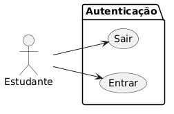
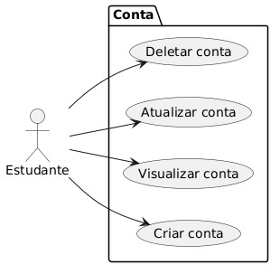
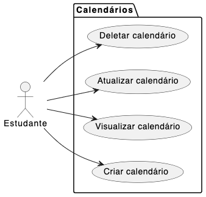
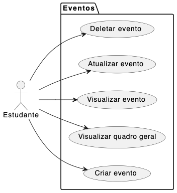
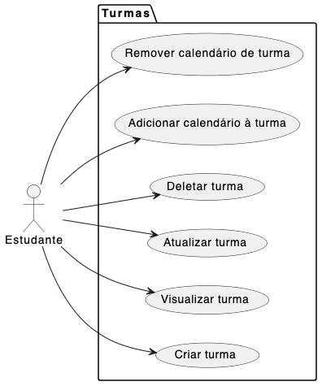
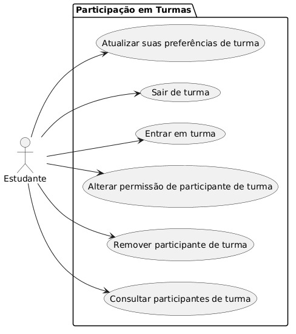

# Modelo de Casos de Uso

## Histórico de Revisões

|   Data   | Versão  |                              Descrição                               |  Autores  |
| :------: | ------- | :------------------------------------------------------------------: | :-------: |
| 24/04/26 | 1       |        Criação dos casos de uso principais sem detalhadamento        | Giordanni |
| 01/05/26 | 2       |   Divisão de casos de uso grandes em menores. Ainda sem detalhamento | Giordanni |
| 14/05/26 | 3       | Reorganização modular, padronização e detalhamento inicial dos CDUs  | Giordanni |
| 09/06/26 | 4       | Remoção e atualização de casos de uso (CDU-008, CDU-013, CDU-029)    | André     |

## Diagrama de Casos de Uso

## Autenticação

* [CDU-001 Entrar](001/cdu_001.md)
* [CDU-002 Sair](002/cdu_002.md)

## Conta

* [CDU-003 Criar conta](003/cdu_003.md)
* [CDU-004 Visualizar conta](004/cdu_004.md)
* [CDU-005 Atualizar conta](005/cdu_005.md)
* [CDU-006 Deletar conta](006/cdu_006.md)

## Calendários

* [CDU-007 Criar calendário](007/cdu_007.md)
* ~~CDU-008 Consultar calendários~~
* [CDU-009 Visualizar calendário](009/cdu_009.md)
* [CDU-010 Atualizar calendário](010/cdu_010.md)
* [CDU-011 Deletar calendário](011/cdu_011.md)

## Eventos

* [CDU-012 Criar evento](012/cdu_012.md)
* [CDU-013 Visualizar quadro geral](013/cdu_013.md)
* [CDU-014 Visualizar evento](014/cdu_014.md)
* [CDU-015 Atualizar evento](015/cdu_015.md)
* [CDU-016 Deletar evento](016/cdu_016.md)

## Turmas

* [CDU-017 Criar turma](017/cdu_017.md)
* [CDU-018 Visualizar turma](018/cdu_018.md)
* [CDU-019 Atualizar turma](019/cdu_019.md)
* [CDU-020 Deletar turma](020/cdu_020.md)
* [CDU-021 Adicionar calendário à turma](021/cdu_021.md)
* [CDU-022 Remover calendário de turma](022/cdu_022.md)
* ~~CDU-029 Consultar turmas~~

## Participação em Turmas

* [CDU-023 Consultar participantes de turma](023/cdu_023.md)
* [CDU-024 Remover participante de turma](024/cdu_024.md)
* [CDU-025 Alterar permissão de participante de turma](025/cdu_025.md)
* [CDU-026 Entrar em turma](026/cdu_026.md)
* [CDU-027 Sair de turma](027/cdu_027.md)
* [CDU-028 Atualizar suas preferências de turma](028/cdu_028.md)
