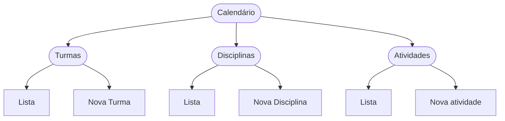
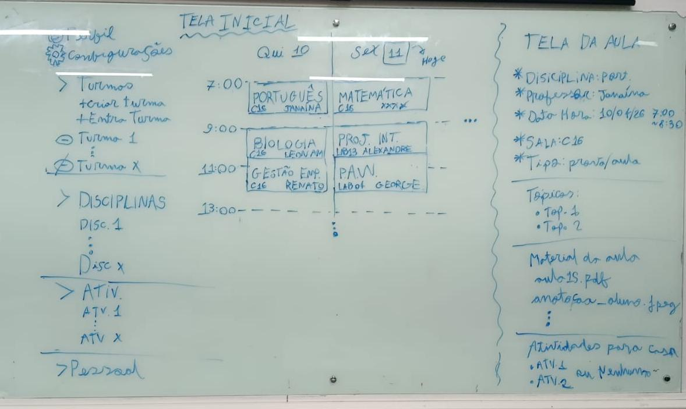
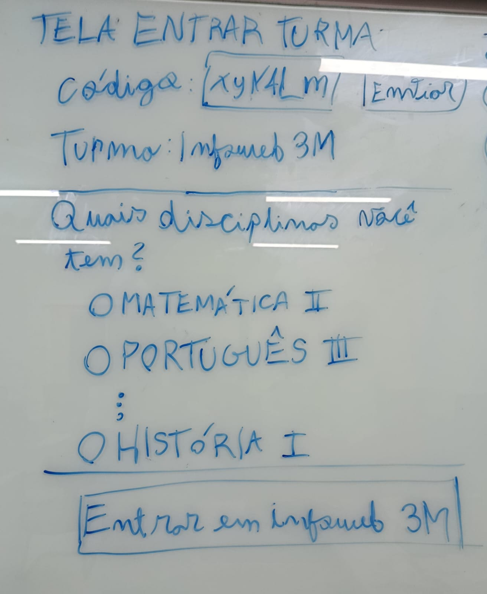
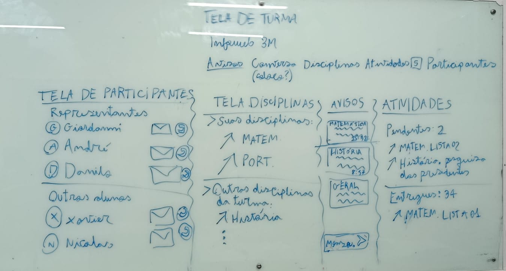

# Protótipos de Interface com o Usuário

## Histórico de Revisões

| Data | Versão | Descrição | Autores |
| :--: | :----: | :-------: | :-----: |
| 10/04/2026 | 1 | Versão inicial |  Giordanni |
| - | - | - |  - |

## 1. Mapa do Site

<!-- > Obs.: propõem-se a utilização de alguma ferramenta que possibilite a representação textual do diagrama. como o seguinte exemplo: -->

[LINK PARA O PROTÓTIPO NO FIGMA](https://www.figma.com/design/i93eN1r3KeTMjRQTGFBYK9/Projeto-CAP?node-id=2116-2&t=XqjvNB2PL1zuMOC6-1)

### A. Tela 1: Index

<!-- > Obs. Substituir pela captura das imagens, sejam elas provenientes do Figma (anexar também o link para o Figma) ou já em HTML e CSS... -->

[LINK para Figma com o protótipo](https://www.figma.com/design/jx7SPrYMZ6xO9VjKgnUf2Q/Untitled?node-id=29-2&t=6IfTibURJLB86N1C-1)

### B. Tela 2: Entrar em Turma

<!-- > Obs. Substituir pela captura das imagens, sejam elas provenientes do Figma (anexar também o link para o Figma) ou já em HTML e CSS... -->

[LINK para Figma com o protótipo](https://www.figma.com/design/jx7SPrYMZ6xO9VjKgnUf2Q/Untitled?node-id=29-2&t=6IfTibURJLB86N1C-1)

### C. Tela 3: Turma

<!-- > Obs. Substituir pela captura das imagens, sejam elas provenientes do Figma (anexar também o link para o Figma) ou já em HTML e CSS... -->

[LINK para Figma com o protótipo](https://www.figma.com/design/jx7SPrYMZ6xO9VjKgnUf2Q/Untitled?node-id=29-2&t=6IfTibURJLB86N1C-1)
